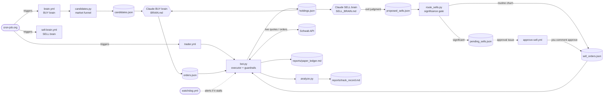

# schwab-trader 🤖📈

An AI-driven, guardrailed **day-trading bot** for Charles Schwab. **Two Claude "brains"** run
the strategy — one **picks buys**, a separate one **decides exits by judgment** (no mechanical
stop-losses) — and an executor places the trades. It's **hands-off by default**: it trades on
its own and only pings you to approve selling a *significant* position (a big winner, a
long-held name, or a large chunk of the book). All on GitHub Actions, no server to babysit.

> **Status: paper-trading experiment.** It ships in **paper mode** (`DRY_RUN=true`) — it
> simulates trades and tracks a P&L scorecard without touching real money. Prove it works
> on paper before ever going live. Trading is risky; you run this at your own risk.

**👉 To set up your own copy, follow [SETUP.md](SETUP.md).** This page explains what it is,
how it works, how to tune it, and where to see results.

---

## How it works

Independent pieces, wired together through files in `signals/` and triggered by an external
cron. The **brains decide**, the **executor acts** — they never run in the same process, so the
bot executes fast without a brain in the loop. Buying and selling are **two separate brains** on
purpose: selling is where the edge and the pain live, so it gets its own dedicated judgment.



1. **`candidates.py`** builds a wide funnel — movers, upcoming earnings, trading halts, fresh
   SEC 8-Ks, news — into `signals/candidates.json`.
2. **The BUY brain** (`brain.yml` running Claude against **`BRAIN.md`**) reads that funnel + what
   it holds, researches, and writes BUY picks to `signals/orders.json`. It never sells.
3. **The SELL brain** (`sell-brain.yml` against **`SELL_BRAIN.md`**) judges each holding on
   *thesis health, not price* — biases hard toward HOLD, never sells on a drawdown alone — and
   writes the names it wants to exit to `signals/proposed_sells.json`.
4. **`route_sells.py`** is the money-gate: routine exits sell **autonomously**; only *significant*
   positions (long-held, big winner, or a large share of the book) get parked in
   `pending_sells.json` and raise a GitHub issue for you to **approve**. A true catastrophe sells
   immediately anyway.
5. **`bot.py`** reads the BUY picks + the approved/autonomous sells, prices off Schwab's *live*
   quote, enforces the guardrails, places the trades, and re-writes `holdings.json` + the ledger.
6. **`analyze.py`** scores closed trades (win rate, expectancy, by-signal breakdown);
   **`watchdog.yml`** alerts you if the executor stalls during market hours.

---

## Repo map

| File | What it is |
|------|------------|
| **`bot.py`** | The executor. Places/exits trades, enforces all risk guardrails, manages the paper book. |
| **`candidates.py`** | Market-data funnel → `signals/candidates.json`. Pure stdlib, no Schwab needed. |
| **`BRAIN.md`** | **The BUY strategy, in plain English.** Edit this to change how the buy brain thinks. |
| **`SELL_BRAIN.md`** | **The EXIT playbook, in plain English.** How the sell brain decides what to hold vs. sell. |
| **`route_sells.py`** | The money-gate: routes each proposed sell to autonomous vs. needs-your-approval. |
| **`STRATEGY.md`** | The high-level risk rules / prime directive. |
| **`analyze.py`** | Track-record analyzer → `reports/track_record.md` (win rate, expectancy, attribution). |
| **`.github/workflows/`** | `brain.yml` (buys), `sell-brain.yml` (exits), `approve-sell.yml` (approve a significant sell), `trader.yml` (executes), `watchdog.yml` (stall alert). |
| **`auth_setup.py`** | One-time Schwab OAuth login → refresh token. |
| **`accounts.py` / `place_order.py`** | Manual helpers: view balances, place a single order by hand. |
| **`config.py` / `schwab_session.py`** | Credential loading + authenticated Schwab client. |
| **`signals/`** | Live state the pieces pass between each other (orders, holdings, candidates, latest read). |
| **`reports/`** | Human-readable output: `paper_ledger.md` (P&L) and `track_record.md` (edge analysis). |
| **`SETUP.md`** | Step-by-step guide to run your own copy (built for a human *or* a Claude agent). |
| **`dashboard_cell.py` / `index.html`** | Optional viewers for your data (set your repo path inside). |

---

## ⚙️ Tune it (the knobs you'll actually touch)

Two ways to change behavior — pick whichever is easier:
- **Just ask your Claude:** e.g. *"change the per-trade cap to $200"* — these are all clearly
  labeled constants at the top of the file.
- **Or edit it yourself** — here's where each common knob lives:

| Want to change… | Set this | Where | Default |
|-----------------|----------|-------|---------|
| Paper vs. **real money** | `DRY_RUN` variable | GitHub repo Variables | `true` (paper) |
| **Max $ per trade** | `MAX_DOLLARS_PER_TRADE` | `bot.py` (top) | `150` |
| **Starting paper cash** | `PAPER_START_EQUITY` | `bot.py` (top) | `1000` |
| **Trading window** (buffer before/after the session) | `SESSION_BUFFER_MIN` | `bot.py` (top) | `60` min |
| **Penny-stock floor** | `MIN_SHARE_PRICE` | `bot.py` (top) | `$2` |
| **Anti-chase slippage cap** | `MAX_SLIPPAGE` | `bot.py` (top) | `5%` |
| **How it BUYS / picks** | edit the prose | **`BRAIN.md`** | — |
| **How it SELLS / exits** | edit the prose | **`SELL_BRAIN.md`** | — |
| **"Long-held" approval threshold** | `LONG_HELD_DAYS` | GitHub repo Variables | `10` days |
| **"Big winner" approval threshold** | `TOP_GAIN_PCT` | GitHub repo Variables | `+25%` |
| **"Large position" approval threshold** | `TOP_SIZE_PCT` | GitHub repo Variables | `35%` of book |
| Funnel sources & limits | the `KNOBS` block | `candidates.py` (top) | — |

The whole strategy is **plain-English in `BRAIN.md`** — change the trading style by editing that
file, no code required.

---

## 📊 Where to see results

After it runs, check these (they auto-update each cycle):
- **`reports/paper_ledger.md`** — running equity, cash, open positions, realized P&L, every closed trade.
- **`reports/track_record.md`** — the edge analysis: win rate, **expectancy**, drawdown, and a
  breakdown of which *signals* actually make money.
- **`signals/latest.md`** — the BUY brain's reasoning for its most recent run (what it saw, why it picked).
- **`signals/sell_review.md`** — the SELL brain's per-position rulings (hold vs. sell, and why) each run.

---

## ❓ Troubleshooting / FAQ

| Symptom | Cause & fix |
|---------|-------------|
| Bot runs fail with **`invalid_grant` / HTTP 400** | The Schwab refresh token expired (~7-day limit). Re-run `python auth_setup.py` and update the `SCHWAB_REFRESH_TOKEN` secret. |
| **"Market CLOSED — no-op"** in the logs | Working as intended — the bot only trades **08:30–17:00 ET**, Mon–Fri. |
| **No trades / nothing happening** | Check: `DRY_RUN` value, market hours, the token is valid, and `signals/orders.json` is fresh. |
| **Weak or empty picks** | Missing `FMP_API_KEY` / `ALPHA_API_KEY` — the funnel degrades without them. |
| **Either brain never runs** | `CLAUDE_CODE_OAUTH_TOKEN` secret isn't set, or the brain's cron isn't pointed at the right workflow file (see SETUP.md). |
| **GitHub issue: "🤔 Sell approval needed"** | Working as intended — the sell brain wants to exit a *significant* position. Comment **`approve`** (all) / **`approve SYM`** (one) to sell, or **`hold`** to keep. Routine sells never ask. |
| **It never auto-sells on a loss** | By design — there are no stop-losses. The sell brain exits on a broken *thesis*, not on price, so a normal drawdown is held. |
| Bot stopped and nobody noticed | The `executor-watchdog` workflow opens an alert issue when it stalls during market hours. |
| **How do I go live?** | Only after `track_record.md` shows positive expectancy over a real sample — then set `DRY_RUN=false`. See SETUP.md. |
| **How do I change the strategy?** | Edit **`BRAIN.md`** (buys) and **`SELL_BRAIN.md`** (exits) — plain English, no code. |

---

## Running the manual scripts locally (optional)

The repo also includes hand-operated helpers (not needed for the automated bot):

```bash
pip install -r requirements.txt
cp .env.example .env          # fill in your Schwab app key/secret
python auth_setup.py          # one-time login -> token.json
python accounts.py            # view balances & positions
python place_order.py BUY AAPL 1 185.00   # place one order by hand
```
