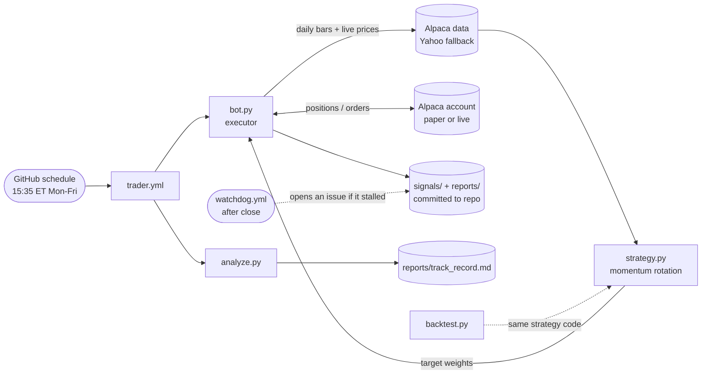

# schwab-trader → systematic ETF momentum bot on Alpaca 🤖📈

A fully automated, **backtested** trading bot that runs on GitHub Actions with nothing to
babysit. It rotates a small portfolio of liquid ETFs by momentum, steps aside into T-bills
when nothing is trending, and trades once a day on [Alpaca](https://alpaca.markets)
(paper account by default, real money when you say so).

> **Status: paper mode (`DRY_RUN=true`).** Prove it on the Alpaca paper account first.
> Trading is risky; nothing here is a guarantee of profit or financial advice.

**👉 Set it up: [SETUP.md](SETUP.md)** (about 15 minutes, no developer-portal approvals,
no token that expires). **The rules: [STRATEGY.md](STRATEGY.md).**
**The evidence: [reports/backtest.md](reports/backtest.md).**

---

## Why this version exists

The previous design (kept in [`legacy/`](legacy/)) used Schwab's API plus two Claude
"brains" picking small-cap news trades. It failed on every axis that matters:

| Problem | Old design | This design |
|---|---|---|
| Broker auth | Schwab OAuth refresh token **expired every 7 days**; bot froze for weeks | Alpaca static API keys: set once |
| Decision engine | Claude subscription hit its **weekly quota** → no picks for 2 weeks | Deterministic strategy, no LLM in the loop |
| Edge | 14 paper trades, **14% win rate, negative expectancy** | 18-year backtest, Sharpe 0.72 vs SPY 0.65, max drawdown -19% vs -52% |
| What it traded | Small caps with 1–2% spreads and earnings gaps | Liquid ETFs, ~1 bp spreads, no single-stock risk |
| Cadence | Every 15 min, all day | Once a day, last hour of the session |
| P&L tracking | Home-grown JSON ledger | The broker's own books |

## How it works



1. **`strategy.py`** — the rules, as pure functions. Rank 34 ETFs by average 3/6/12-month
   return; hold the top 5 that are also above their 200-day average with positive momentum;
   inverse-volatility weights; weekly rebalance with hysteresis; idle capital in `BIL`.
2. **`bot.py`** — once per trading day in the last two hours: load bars, compute targets,
   reconcile the Alpaca account (sells first, buys capped to cash), write snapshots.
   Hard rails: never leveraged, never short, one strategy step per day, a **20% drawdown
   kill switch** that liquidates and halts until a human resets it.
3. **`backtest.py`** — the same strategy code over 18 years of daily data
   (`python backtest.py`, `--grid` for robustness). Read `reports/backtest.md`.
4. **`analyze.py`** — the live track record straight from Alpaca's fills and equity curve.
5. **`watchdog.yml`** — opens a GitHub issue if the bot did not run on a trading day.
6. **`analyst.yml`** *(optional)* — a weekly plain-English review written by Claude.
   It cannot trade. If the Claude token is missing or out of quota, nothing else cares.

## Repo map

| File | What it is |
|------|------------|
| `strategy.py` | The strategy. `Params` holds every knob. |
| `bot.py` | The executor (paper or live). |
| `alpaca.py` | Minimal stdlib Alpaca client (trading + market data). |
| `data.py` | Keyless Yahoo daily bars with a local cache (backtests + fallback). |
| `backtest.py` | Backtester + robustness grids → `reports/backtest.md`. |
| `analyze.py` | Track record from the broker → `reports/track_record.md`, `reports/paper_ledger.md`. |
| `watchdog.py` | Daily heartbeat check used by `watchdog.yml`. |
| `tests/` | Unit tests (strategy, backtest parity, executor end-to-end with a fake broker). |
| `signals/` | `state.json` (strategy state, high-water mark), `targets.json`, `holdings.json`. |
| `reports/` | `backtest.md`, `today.md` (last run log), `track_record.md`, `paper_ledger.md`. |
| `legacy/` | The retired Schwab + Claude-brain version, for reference. |

## Knobs

| Want to change… | Where | Default |
|---|---|---|
| Paper vs **real money** | repo variable `DRY_RUN` | `true` |
| Dollars the bot manages | repo variable `MAX_CAPITAL` | whole account |
| Drawdown kill switch | repo variable `MAX_DRAWDOWN_HALT` | `0.20` |
| Trade window before close | repo variable `TRADE_WINDOW_MIN` | `120` |
| Number of holdings, lookbacks, universe, cash proxy… | `Params` / `UNIVERSE` in `strategy.py` | see file |

Change a knob in `strategy.py` → run `python backtest.py --grid` → look at the numbers
**before** you trust it. That is the whole point of having the backtester.

## Where to look

- **`reports/today.md`** — what the bot did in its last run and why.
- **`signals/targets.json`** — today's target weights and the strategy's notes.
- **`reports/track_record.md`** — live results (equity, drawdown, every closed trade).
- **`reports/backtest.md`** — what to expect, from history.

## Run locally

```bash
python -m unittest discover -s tests -v      # 22 tests, no network, ~0.2s
python backtest.py                           # downloads ~35 ETFs from Yahoo, ~2s to run
python backtest.py --grid --start 2015-01-01
ALPACA_API_KEY=... ALPACA_SECRET_KEY=... NO_TRADE=true FORCE_RUN=true python bot.py   # "what would it do"
```
