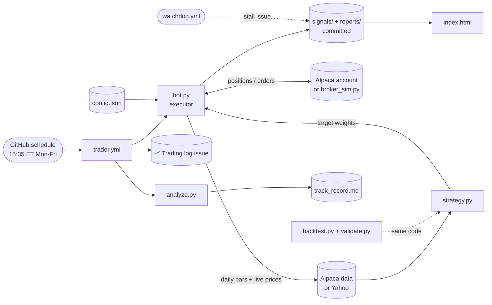

# schwab-trader → systematic ETF momentum bot 🤖📈

A fully automated, **backtested and out-of-sample validated** trading bot that runs on
GitHub Actions with nothing to babysit. It holds a trend-timed slice of the S&P 500 plus
a momentum rotation across 34 liquid ETFs, steps into T-bills when nothing is trending,
and trades once a day. **It runs today with zero accounts or keys** on a built-in
simulator; add [Alpaca](https://alpaca.markets) keys later to trade a real paper or live
account with the same code.

> Trading is risky. Nothing here is a guarantee of profit or financial advice. The
> numbers below are historical simulations with realistic costs, not promises.

**Setup: [SETUP.md](SETUP.md) · Rules: [STRATEGY.md](STRATEGY.md) · Evidence:
[reports/backtest.md](reports/backtest.md) and [reports/validation.md](reports/validation.md)
· Live view: [index.html](index.html) (enable GitHub Pages on the repo root)**

---

## What you get

| | |
|---|---|
| **Strategy** | Trend-timed SPY core (30%) + top-6 momentum rotation over 34 ETFs, inverse-vol weights, 40% cluster cap, T-bills when defensive. Every knob in `config.json`. |
| **Evidence** | 18-year backtest: **Sharpe 0.82 vs SPY 0.65, max drawdown -17% vs -52%**. Walk-forward: parameters chosen on 2008–2016 score **Sharpe 0.97 out-of-sample** on 2017–2026. Bootstrap, sensitivity and timing-luck tests in `reports/validation.md`. |
| **Runs today** | No keys → the executor trades a built-in simulator at real prices and commits its book to the repo. First run already happened (see `reports/today.md`). |
| **Broker** | Alpaca: static keys (no 7-day OAuth expiry), paper and live from the same code, fractional shares. |
| **Safety** | Long-only, never leveraged, sells before buys, one strategy step per day, only touches its own universe, 30% drawdown kill switch, broker-block detection. |
| **Ops** | `doctor.py` preflight, `watchdog` issue on a missed day, a rolling **"📈 Trading log"** issue with every run, weekly backtest refresh, CI tests on every push, a static dashboard. |
| **No LLM in the loop** | The old Claude "brains" are gone from the trading path. An optional weekly Claude review (`analyst.yml`) can only write a report. |

## How it works



## Repo map

| File | What it is |
|------|------------|
| `strategy.py` | The rules as pure functions. `Params` = every knob. Optional sleeves (mean reversion, vol targeting, breadth regime, defensive momentum) are implemented, tested, and off. |
| `config.json` / `config.py` | Presets (`balanced`, `growth`, `rotation_only`, `conservative`) and executor limits. Unknown keys are fatal on purpose. |
| `bot.py` | The executor. Picks Alpaca if keys exist, else the simulator. |
| `broker_sim.py` | File-backed simulator with the Alpaca interface, real prices, 5 bps slippage. |
| `alpaca.py` | Minimal stdlib Alpaca client (trading + data). |
| `data.py` | Keyless Yahoo daily bars with a local cache. |
| `backtest.py` | Backtester + grids (`--grid`, `--grid2`, `--grid3`, `--grid4`). |
| `validate.py` | Walk-forward, sensitivity, timing luck, bootstrap, rolling windows → `reports/validation.md`. |
| `analyze.py` | Track record from the broker's fills and equity curve. |
| `doctor.py` | Preflight checklist (`--strict` for CI). |
| `watchdog.py` | Daily heartbeat check. |
| `index.html` | Dashboard. Serve the repo root (GitHub Pages → main, `/`). |
| `tests/` | 29 tests: indicators, targets, backtest/live parity, executor end-to-end on a fake broker and on the simulator. |
| `signals/` | `state.json`, `targets.json`, `holdings.json`, `performance.json`, `sim_account.json`. |
| `reports/` | `backtest.md`, `validation.md`, `today.md`, `track_record.md`, `paper_ledger.md`. |
| `legacy/` | The retired Schwab + Claude-brain version. |

## Knobs

Edit `config.json` (then run `python backtest.py` to see what you did):

```json
{ "preset": "balanced",          // balanced | growth (QQQ core) | rotation_only | conservative
  "strategy": { "mom_top_n": 6 },  // any strategy.Params field
  "executor": { "max_capital": null, "max_drawdown_halt": 0.30, "trade_window_min": 120 } }
```
Repo **variables** of the same name in upper case (`MAX_CAPITAL`, `MAX_DRAWDOWN_HALT`,
`TRADE_WINDOW_MIN`) override the file; `DRY_RUN=false` switches Alpaca to the live account.

## Run locally

```bash
python -m unittest discover -s tests -v   # 29 tests, no network
python doctor.py                          # preflight
python backtest.py --grid4                # candidate-defaults comparison
python validate.py                        # ~2 min, writes reports/validation.md
NO_TRADE=true FORCE_RUN=true python bot.py   # what would it do right now
python -m http.server                     # then open http://localhost:8000/index.html
```
Python 3.11, stdlib only.
